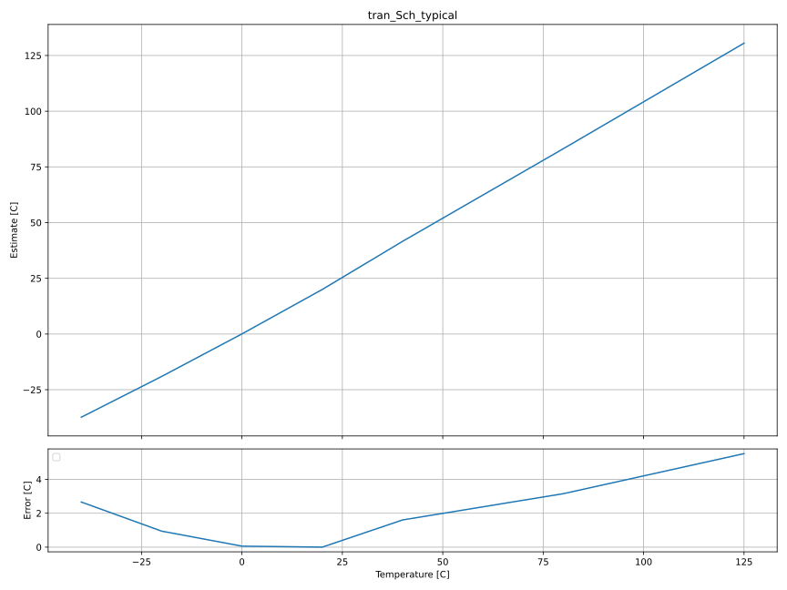
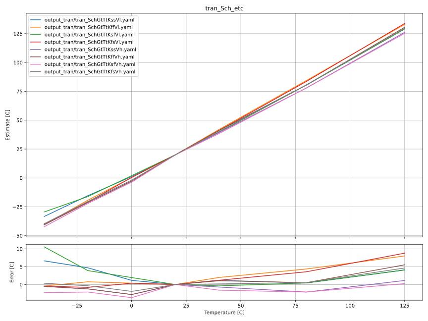
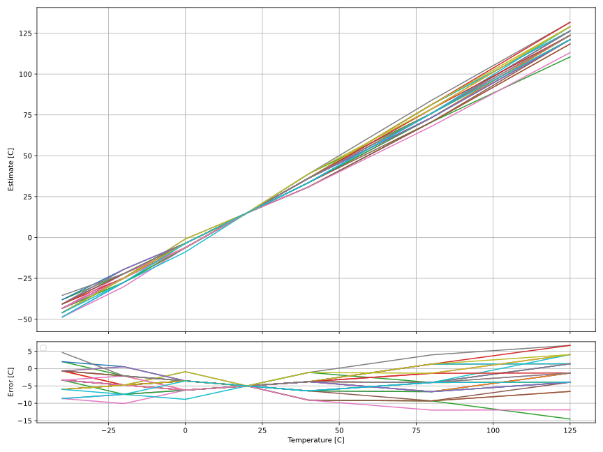

# CNR_GR00_SKY130NM

# Who
Carsten Wulff 

# Why
Demo of a temperature sensor

# How
I really like the fact that the difference in diode voltage between two diodes
or bjt's are given by 
 
$$ \Delta V_{BE} = \frac{k T}{q} \log A $$
 
where A difference in current densities.
 
The temperature sensor is a first order continuous time sigma-delta
modulator with the delta base-emitter voltage as input.

The schematics are as follows.
 
## Temperature to Current (TFI)

Using VDD as the reference voltage, a voltage to current converter is used to
create an 1 uA bias current. A current mirror copies to two bipolars.

## Current to Time (IFT)

A resistor is placed between the larger diode (VDA) and a virtual ground. The
virtual ground is forced by the OTA to be equal to the smaller diode (VD). 

As such, the current through the resistor also has to flow through a capacitor
acting like an integrator.

To ensure the voltage at VO is controlled there is a feedback DAC (controlled by
DOWN_N_1V8) that inverses the integration. 

## Time to Digital (TTD)

The output of the integrator is sampled by a strong arm comparator. The output
signal is fed back to the IFT to reverse the integration when needed. 

# What

| What            | Lib/Folder       | Cell/Name |
| :-              | :-:              | :-:       |
| Schematic       | CNR_GR00_SKY130NM | CNR_GR00 |
| Layout          | CNR_GR00_SKY130NM | CNR_GR00 |
| LPE             | CNR_GR00_SKY130NM | CNR_GR00 |

# Changelog/Plan
| Version | Status | Comment|
| :-| :-| :-|
|0.1.0 | :white_check_mark: | Working prototype |
|0.2.0 | :white_check_mark: | Fixed bias, increased accuracy |

# Signal interface
| Signal    | Direction | Domain  | Description                         |
|:----------|:---------:|:-------:|:------------------------------------|
| VDD_1V8   | Input     | VDD_1V8 | Main supply                         |
| RESET_1V8 | Input     | VDD_1V8 | Reset integrator                    |
| PWRUP_1V8 | Input     | VDD_1V8 | Power up the circuit                |
| DO_1V8    | Output    | VDD_1V8 | Digital output                      |
| CK_1V8    | Input     | VDD_1V8 | Clock for comparator, default 5 MHz |
| VSS       | Input     | Ground  |                                     |

# Key parameters
| Parameter   | Min | Typ             | Max | Unit |
|:------------|:---:|:---------------:|:---:|:----:|
| Technology  |     | Skywater 130 nm |     |      |
| AVDD        | 1.7 | 1.8             | 1.9 | V    |
| Temperature | -40 | 27              | 125 | C    |

    
# Status

| Stage                       | TYPE | Status             | Comment |
|:----------------------------|:----:|:------------------:|:-------:|
| Specification               | DOC  | :white_check_mark: |         |
| Schematic                   | VIEW | :white_check_mark: |         |
| Schematic simulation        | VER  | :white_check_mark: |         |
| Layout                      | VIEW | :x:                |         |
| Layout parasitic extraction | VIEW | :x:                |         |
| LPE simulation              | VER  | :x:                |         |
| LVS                         | VER  | :x:                |         |
| DRC                         | VER  | :x:                |         |
| ERC                         | VER  | :x:                |         |
| ANT                         | VER  | :x:                |         |

# Temperature characteristics

The temperature sensor seems decent. A one-point accuracy of about +-5 degrees.

The variation in VDD with corners is assumed to be possible to know, and
adjusted for in the final temperature error calculation as per [plot.py](sim/CNR_GR00/plot.py)

## Typical corner

## Extreme Test Condition

## Monte-Carlo

