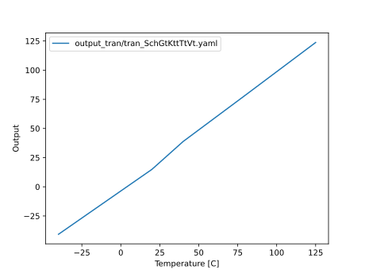

# CNR_GR00_SKY130NM

# Who
<<<<<<< HEAD
wulff

# Why
 <explain why you made this module>

# How
 <explain short how you made this module>
=======
Carsten Wulff 

# Why
Demo of a temperature sensor

# How
I really like the fact that the difference in diode voltage between two diodes
or bjt's are given by 
 
$$ \Delta V_{BE} = \frac{k T}{q} \log A $$
 
where A difference in area (or indeed current).
 
The temperature sensor is a first order continuous time sigma-delta
modulator with the delta base-emitter voltage as input.

The schematics are as follows.
 
## Temperature to Current (TFI)

Resistive biased current mirror that feeds into two diodes, and provides bias
currents.

## Current to Time (IFT)

A resistor is placed between the larger diode (VDA) and a virtual ground. The
virtual ground is forced by the OTA to be equal to the smaller diode (VD). 

As such, the current through the resistor also has to flow through a capacitor
acting like an integrator.

## Time to Digital (top)

The output of the integrator is sampled by a strong arm comparator. The output
signal is fed back to the IFT to reverse the integration.

>>>>>>> tsense

# What

| What            | Lib/Folder       | Cell/Name |
| :-              | :-:              | :-:       |
<<<<<<< HEAD
| Schematic       | CNR_GR00_SKY130NM | CNR_GR00 |
| Layout          | CNR_GR00_SKY130NM | CNR_GR00 |
| LPE             | CNR_GR00_SKY130NM | CNR_GR00 |
=======
| Schematic       | CNR_GR01_SKY130NM | CNR_GR01 |
| Layout          | CNR_GR01_SKY130NM | CNR_GR01 |
| LPE             | CNR_GR01_SKY130NM | CNR_GR01 |
>>>>>>> tsense

# Changelog/Plan
| Version | Status | Comment|
| :-| :-| :-|
<<<<<<< HEAD
|0.1.0 | :x: | Make something |

# Signal interface
| Signal       | Direction | Domain  | Description                               |
| :---         | :---:     | :---:   | :---                                      |
| VDD_1V8         | Input     | VDD_1V8 | Main supply                               |
| VSS         | Input     | Ground  |                                           |
| PWRUP_1V8     | Input    | VDD_1V8 | Power up the circuit                       |

# Key parameters
| Parameter           | Min     | Typ           | Max     | Unit  |
| :---                | :-:     | :-:           | :-:     | :---: |
| Technology          |         | Skywater 130 nm |         |       |
| AVDD                | 1.7    | 1.8           | 1.9    | V     |
| Temperature         | -40     | 27            | 125     | C     |

# Status

| Stage                       | TYPE | Status | Comment                        |
| :---                        | :-:  | :---:  | :--:                           |
| Specification               | DOC  | :x:    |                                |
| Schematic                   | VIEW | :x:    |                                |
| Schematic simulation        | VER  | N/A    |                                |
| Layout                      | VIEW | :x:    |                                |
| Layout parasitic extraction | VIEW | :x:    |                                |
| LPE simulation              | VER  | :x:    |                                |
| LVS                         | VER  | :x:    |                                |
| DRC                         | VER  | :x:    |                                |
| ERC                         | VER  | :x:    |                                |
| ANT                         | VER  | :x:    |                                |
=======
|0.1.0 | :white_check_mark: | Working prototype |

# Signal interface
| Signal     | Direction | Domain  | Description                   |
|:-----------|:---------:|:-------:|:------------------------------|
| VDD_1V8    | Input     | VDD_1V8 | Main supply                   |
| RESET_1V8  | Input     | VDD_1V8 | Reset integrator              |
| PWRUP_1V8  | Input     | VDD_1V8 | Power up the circuit          |
| DO_1V8     | Output    | VDD_1V8 | Digital output                |
| VO_1V8     | Output    | VDD_1V8 | Analog signal pre-comparator  |
| DOWN_N_1V8 | Output    | VDD_1V8 | DAC feedback, short to DO_1V8 |
| VSS        | Input     | Ground  |                               |

# Key parameters
| Parameter   | Min | Typ             | Max | Unit |
|:------------|:---:|:---------------:|:---:|:----:|
| Technology  |     | Skywater 130 nm |     |      |
| AVDD        | 1.7 | 1.8             | 1.9 | V    |
| Temperature | -40 | 27              | 125 | C    |

    
# Status

| Stage                       | TYPE | Status             | Comment |
|:----------------------------|:----:|:------------------:|:-------:|
| Specification               | DOC  | :white_check_mark: |         |
| Schematic                   | VIEW | :white_check_mark: |         |
| Schematic simulation        | VER  | N/A                |         |
| Layout                      | VIEW | :x:                |         |
| Layout parasitic extraction | VIEW | :x:                |         |
| LPE simulation              | VER  | :x:                |         |
| LVS                         | VER  | :x:                |         |
| DRC                         | VER  | :x:                |         |
| ERC                         | VER  | :x:                |         |
| ANT                         | VER  | :x:                |         |

# Temperature characteristics

The temperature sensor is functional, but still buggy, as can be seen from the plot below.

The principle, however, seems to work well.

>>>>>>> tsense
